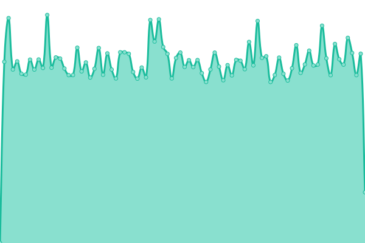

# [📈 Live Status](https://AsurRaa.github.io/status): <!--live status--> **🟧 Partial outage**

This repository contains the open-source uptime monitor and status page for [AsurRaa Technologies](engineer.asurraa.com), powered by [Upptime](https://github.com/upptime/upptime).

With [Upptime](https://upptime.js.org), you can get your own unlimited and free uptime monitor and status page, powered entirely by a GitHub repository. We use [Issues](https://github.com/AsurRaa/status/issues) as incident reports, [Actions](https://github.com/AsurRaa/status/actions) as uptime monitors, and [Pages](https://AsurRaa.github.io/status) for the status page.

<!--start: status pages-->
<!-- This summary is generated by Upptime (https://github.com/upptime/upptime) -->
<!-- Do not edit this manually, your changes will be overwritten -->
<!-- prettier-ignore -->
| URL | Status | History | Response Time | Uptime |
| --- | ------ | ------- | ------------- | ------ |
|  [sai-website](https://saicambodianartist.com) | 🟩 Up | [sai-website.yml](https://github.com/asurraa/status/commits/HEAD/history/sai-website.yml) | 

 1677ms
     
 | 

<a href="https://status.asurraa.com/history/sai-website">98.61%</a>
    

|  [asurraa-website](https://asurraa.com) | 🟩 Up | [asurraa-website.yml](https://github.com/asurraa/status/commits/HEAD/history/asurraa-website.yml) | 

 824ms
     
 | 

<a href="https://status.asurraa.com/history/asurraa-website">96.37%</a>
    

|  [thakvika-api](https://thakvika-api-dev.asurraa.com) | 🟩 Up | [thakvika-api.yml](https://github.com/asurraa/status/commits/HEAD/history/thakvika-api.yml) | 

 809ms
     
 | 

<a href="https://status.asurraa.com/history/thakvika-api">98.19%</a>
    

|  [thakvika-website](https://thakvika.asurraa.com) | 🟥 Down | [thakvika-website.yml](https://github.com/asurraa/status/commits/HEAD/history/thakvika-website.yml) | 

 0ms
     
 | 

<a href="https://status.asurraa.com/history/thakvika-website">0.00%</a>
    

|  [lv - website](https://lauvann.info/) | 🟩 Up | [lv-website.yml](https://github.com/asurraa/status/commits/HEAD/history/lv-website.yml) | 

 1061ms
     
 | 

<a href="https://status.asurraa.com/history/lv-website">98.61%</a>
    

|  [gogym-api](http://gogym-api-dev.asurraa.com/) | 🟩 Up | [gogym-api.yml](https://github.com/asurraa/status/commits/HEAD/history/gogym-api.yml) | 

 1577ms
     
 | 

<a href="https://status.asurraa.com/history/gogym-api">42.42%</a>
    

|  [gogym-ui](http://gogym-pos-dev.asurraa.com/) | 🟩 Up | [gogym-ui.yml](https://github.com/asurraa/status/commits/HEAD/history/gogym-ui.yml) | 

 1353ms
     
 | 

<a href="https://status.asurraa.com/history/gogym-ui">24.12%</a>
    

|  [akssar](https://akssar.asurraa.com/) | 🟥 Down | [akssar.yml](https://github.com/asurraa/status/commits/HEAD/history/akssar.yml) | 

 800ms
     
 | 

<a href="https://status.asurraa.com/history/akssar">0.00%</a>
    

|  [1ASEM](https://1aseam.asurraa.com/) | 🟩 Up | [1-asem.yml](https://github.com/asurraa/status/commits/HEAD/history/1-asem.yml) | 

 2828ms
     
 | 

<a href="https://status.asurraa.com/history/1-asem">97.82%</a>
    

<!--end: status pages-->

[**Visit our status website →**](https://AsurRaa.github.io/status)

## 📄 License

- Powered by: [Upptime](https://github.com/upptime/upptime)
- Code: [MIT](./LICENSE) © [AsurRaa Technologies](engineer.asurraa.com)
- Data in the `./history` directory: [Open Database License](https://opendatacommons.org/licenses/odbl/1-0/)
